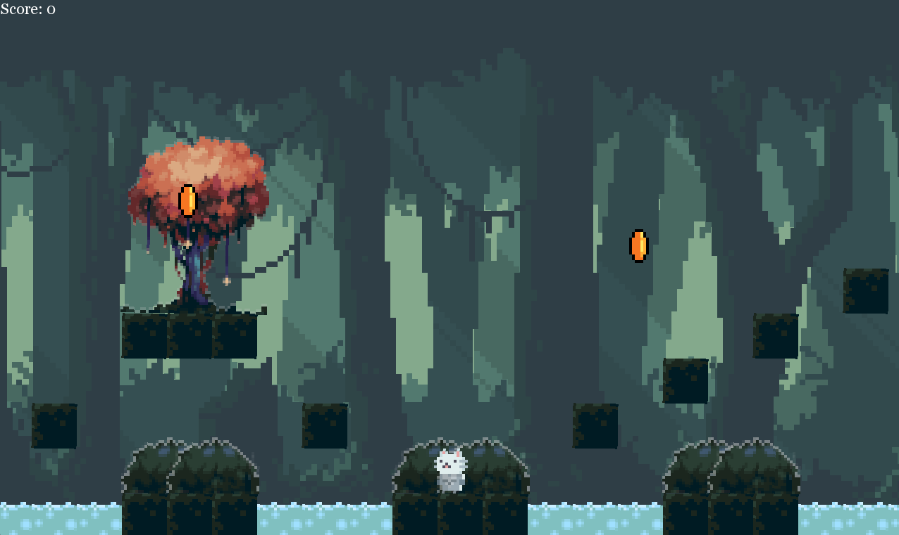
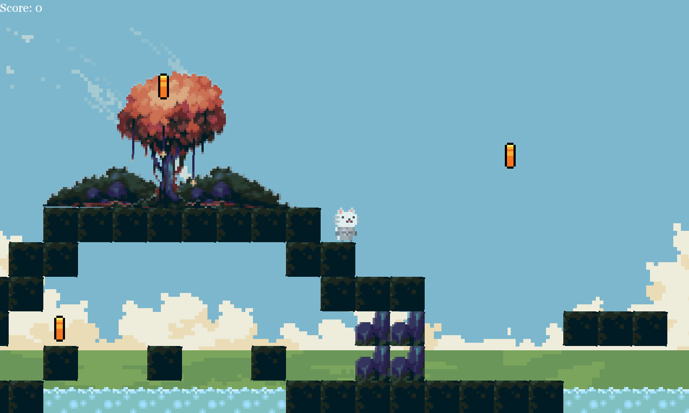
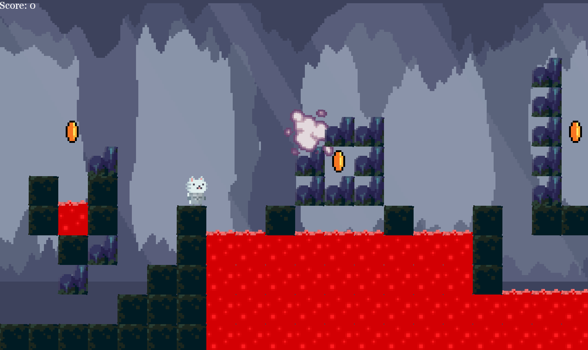

# Meow Knight Game Engine

## Table of Contents
1. [Introduction](#introduction)
2. [Features](#features)
3. [Usage](#usage)
4. [Game Levels](#game-levels)
5. [Customization](#customization)
6. [Controls](#controls)
7. [Contributing](#contributing)
8. [Media](#media)

## Introduction
**Meow Knight** is a game built using a custom game engine designed with flexibility and ease of use in mind. The engine supports AABB collision detection, custom animation handling, scene management, and more. The game consists of three unique levels, each showcasing the engine's capabilities.

## Features
- **AABB Collision Detection:** Robust collision detection using the Axis-Aligned Bounding Box method.
- **Animation Sheet Handling:** Supports both horizontal and vertical animation sheets.
- **Object Lifetime Management:** Automatically manages the lifespan of objects with specific components.
- **Scene Management:** Easily switch between different scenes within the game.
- **Level Loading:** Load levels from configuration files, allowing for custom level creation.
- **Asset Loading:** Supports loading and using any assets you want within the game.
- **Scene-Specific Controls:** Register unique controls for each scene to handle specific actions.
- **Coin Collection:** Collect coins scattered throughout the levels to increase your score.
- **Parallax Effect:** Implemented parallax scrolling to create depth and immersion in the game’s backgrounds.
- **Rock Destruction:** The player can attack to destroy rocks that block the path, adding a strategic element to the gameplay.

## Usage
Once installed, you can start the game by executing the built binary. The engine will automatically load the initial scene and start the game.

## Game Levels
The game includes three levels, each increasing in difficulty. The levels demonstrate various engine features like collision detection, animation, and scene management. As you progress through the levels, you'll find coins that can be collected to increase your score. The parallax effect adds depth to the background, enhancing the visual experience. 

## Customization
- **Levels:** You can create custom levels by editing the configuration files located in the `levels/` directory. Follow the provided templates to ensure proper loading.
- **Assets:** Add new assets to the `assets/` directory and reference them in the level configuration files.
- **Controls:** Modify scene-specific controls by updating the control registration in the scene files.

## Controls
The controls in the game are consistent across all levels, providing a seamless gameplay experience:

- **Move Left:** `A`
- **Move Right:** `D`
- **Jump:** `W`
- **Attack:** `E`
- **Back to Menu:** `Esc`

## Contributing
Contributions are welcome! If you’d like to contribute, please fork the repository, create a feature branch, and submit a pull request.

## Media

